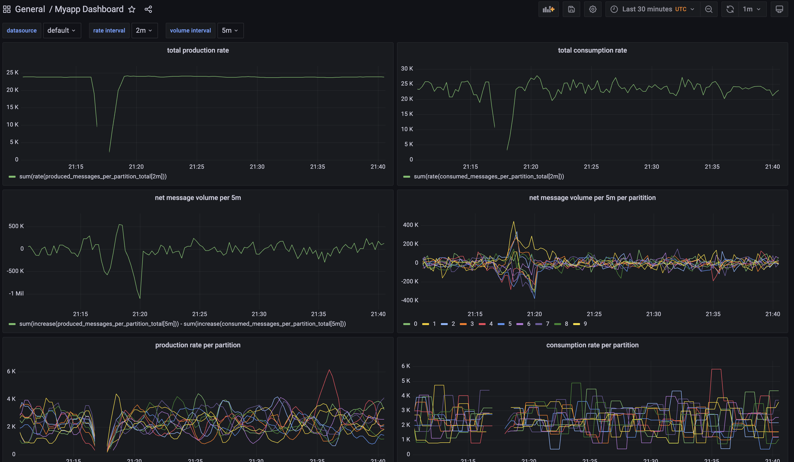

# Demo project for Kafka Consumer Throughput
This is an example project intended to be used as a demo to explore kafka throughput related concerns, examining details with prometheus metrics. I struggled a bit to find good resources online to setup a simple kafka producer and consumer in minikube with prometheus metrics. Setting up prometheus can be really challenging as there are so many knobs. Eventually I found a way to set things up without diving too deep into prometheus giving me what I need. 

Follow the guide in [SETUP.MD](Cluster-Setup.MD) to install and run the scripts

# Viewing Dashboards
There is a saved dashboard called myapp-dashboard.json under the deployment folder. Once you have launched Grafana you can import the file into Grafana.

But first you need to setup a data source using prometheus as your data source type.

Find the nodeport local ip address of prometheus using the following kubectl command:
```
kubectl get services
```

The output looks like this, just grab the ip address and use it to formulate the url for the prometheus data source.


My prometheus ip address is 10.101.101.39 so I will enter `http://10.101.101.39:80` into the 'url' box in Grafana:


Now you can import the dashboard json file using the dialog in Grafana:


Here's how the dashboard looks:




# Running Scenarios

